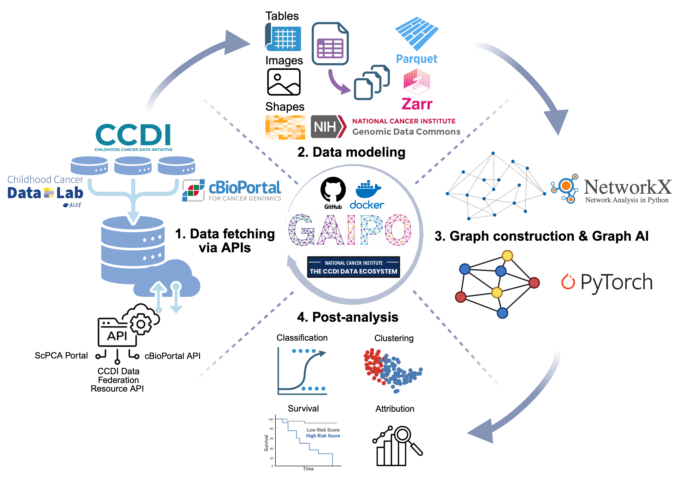
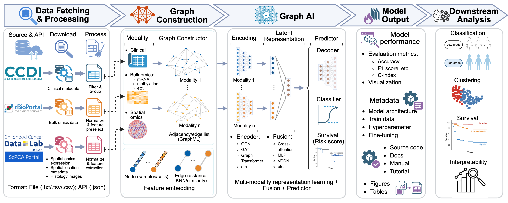

# GAIPO

**Graph Artificial Intelligence for Pediatric Oncology**

The Childhood Cancer Data Initiative (CCDI) ecosystem provides essential clinicogenomic data for deep learning in pediatric cancer research. To enable the efficient use of the CCDI resource for AI model training and implementation, we developed a generic graph AI platform, Graph Artificial Intelligence for Pediatric Oncology (GAIPO), as well as the standards of data, model, and pipeline, to streamline the use of CCDI clinicogenomics data of various data modalities from bulk and single-cell omics data to clinical information in AI development. GAIPO provides a comprehensive workflow: 

(1) Data fetching through CCDI Data Federation Resource API and cBioPortal API, and ScPCA for clinical metadata, multi-omics, and spatial transcriptomics data; 

(2) Data modeling through mapping and harmonizing the fetched clinical and genomics data according to the CCDI data model; 

(3) Graph construction functionalities through GraphML from NetworkX; 

(4) Implementation of previously published graph AI models and development of novel models; 

(5) Post-analysis, such as cancer type classification, patient stratification, clustering, survival analysis, and feature selection. 




## Overview

Advances in artificial intelligence (AI) are shifting the paradigm in precision medicine for pediatric cancer, including biomarker identification, drug discovery, and survival analysis. Studies of advanced AI models for Pediatric oncology research often combine heterogeneous clinical and omics data collected across multiple programs and platforms. GAIPO organizes this process into reproducible modules that can be run independently or as an end-to-end pipeline.

The framework is designed to support:

- Cohort and identifier discovery from CCDI Federation sources.
- Extraction of clinical and multi-omics data.
- Harmonization into CCDI/GDC-supported, analysis-ready data models.
- Modality-specific quality control, feature selection, and scaling.
- Patient-similarity graph construction (for clincogenomics data).
- Graph AI models for tumor classification and survival analysis.
- Model interpretation, biomarker prioritization, and post-model survival analysis.
- Reproducible execution through Docker Compose.

> [!IMPORTANT]
> GAIPO is research software. It is not intended for clinical diagnosis, treatment selection, or other direct clinical use.

## Workflow



The pipeline contains seven ordered stages:

| Stage | CLI name | Purpose | Representative outputs |
| --- | --- | --- | --- |
| 1 | `data_fetch` | Discover and retrieve cohort-level subject and sample identifiers. | Subject IDs, sample IDs, cohort manifests |
| 2 | `data_extract` | Extract clinical and omics data from configured sources. | Raw or source-aligned TSV, Zarr, and Parquet files |
| 3 | `data_model` | Harmonize extracted records into a GDC-shaped data model. | Case, sample, demographic, ID-map, and file-node Parquets |
| 4 | `process` | Perform quality control, feature filtering, normalization, and dimensionality reduction. | Analysis-ready feature matrices and preprocessing metadata |
| 5 | `graph_construct` | Build patient-similarity graphs from processed features. | GraphML files, adjacency data, node features, and graph metadata |
| 6 | `graph_ai_model` | Train and evaluate graph neural networks for prediction and survival tasks. | Model checkpoints, predictions, risk scores, and latent representations |
| 7 | `post_analysis` | Interpret trained models and perform downstream statistical analyses. | Feature rankings, Kaplan–Meier analyses, log-rank results, and figures |

Each stage consumes the outputs of the preceding stage. Intermediate artifacts are retained so that a stage can be rerun without repeating the entire workflow.

## Data and Modeling Components

### Data sources

GAIPO is designed to work with pediatric cancer data available through the CCDI ecosystem and related genomic portals. Depending on the study configuration and access permissions, sources may include:

- PCDC
- Treehouse
- St. Jude Cloud
- Kids First
- CCDI ecDNA
- cBioPortal or PedcBioPortal-compatible studies

Availability varies by cohort. Users are responsible for complying with the data-use agreements, authentication requirements, and access controls of each source.

### Supported data types

The framework can integrate clinical variables with one or more molecular modalities, including:

- mRNA expression
- Copy-number alteration data
- DNA methylation
- miRNA expression

The exact modalities used in a run are defined by the cohort configuration and data availability.

### Graph construction

For clincogenomics data, patients are represented as graph nodes, with node features derived from processed clinical or omics measurements. Edges encode patient similarity, such as cosine similarity under a configurable radius or neighborhood rule. To prevent information leakage, graph-construction parameters estimated from the training set should be reused for validation and test data.

### Graph AI and interpretation

GAIPO supports graph neural network architectures such as GCN, GAT, and GIN. The modeling layer can be configured for:

- Tumor or molecular-subtype classification.
- Time-to-event modeling using a Cox partial-likelihood objective.
- Multi-task learning across classification and survival endpoints.
- Modality-specific graph encoders and cross-attention fusion.

Post-analysis can include feature-attribution summaries, biomarker ranking, latent-space visualization, hierarchical clustering, Kaplan–Meier curves, and log-rank tests.

## Getting Started

### Prerequisites

Choose one of the following execution options:

1. **Docker Compose** — recommended for a reproducible environment.
2. **Local Python environment** — useful for development and debugging.

For either option, clone the repository and enter its root directory:

```bash
git clone https://github.com/<organization-or-user>/GAIPO.git
cd GAIPO
```

Before running the pipeline, review the project configuration and set the required:

- Data-source endpoints and credentials.
- Cohort, diagnosis, and modality selections.
- Input, output, cache, and checkpoint locations.
- Feature-selection and graph-construction parameters.
- Model, training, and random-seed settings.

Do not commit access tokens, passwords, controlled-data identifiers, or other secrets to the repository.

### Local Python environment

Create and activate a virtual environment:

```bash
python -m venv .venv
source .venv/bin/activate
python -m pip install --upgrade pip
python -m pip install -r requirements.txt
```

Run commands from the repository root so that Python can resolve the `src` package and the pipeline can locate its configuration and output directories.

## Running the Pipeline

### Run the complete pipeline

```bash
python -m src.main --all
```

This executes all stages in dependency order:

```text
data_fetch → data_extract → data_model → process → graph_construct → graph_ai_model → post_analysis
```

### Run one stage

```bash
# 1. Fetch subject and sample identifiers
python -m src.main --call data_fetch

# 2. Extract clinical and omics data
python -m src.main --call data_extract

# 3. Build GDC-shaped data-model tables
python -m src.main --call data_model

# 4. Process data and select features
python -m src.main --call process

# 5. Construct patient-similarity graphs
python -m src.main --call graph_construct

# 6. Train and evaluate Graph AI models
python -m src.main --call graph_ai_model

# 7. Run model interpretation and downstream analyses
python -m src.main --call post_analysis
```

When running a single downstream stage, confirm that all required upstream outputs already exist.

### Run selected stages

Pass stage names as a comma-separated list, with no spaces:

```bash
python -m src.main --call data_fetch,data_extract
```

For example, to rebuild the graph and rerun the model and post-analysis:

```bash
python -m src.main --call graph_construct,graph_ai_model,post_analysis
```

### Run through a specified stage

Use `--until` to start at the beginning of the pipeline and stop after the named stage:

```bash
python -m src.main --until graph_construct
```

## Docker Compose

Docker Compose provides the most reproducible way to build and run GAIPO.

### Build the image

```bash
docker compose build
```

Recent Docker Compose versions can optionally delegate builds to Bake:

```bash
export COMPOSE_BAKE=true
docker compose build
```

### Run the complete pipeline

```bash
docker compose run --rm app python -m src.main --all
```

### Run selected stages

```bash
docker compose run --rm app \
  python -m src.main --call data_fetch,data_extract
```

### Run through graph construction

```bash
docker compose run --rm app \
  python -m src.main --until graph_construct
```

The Compose configuration should mount persistent data, output, and model directories so that artifacts remain available after the temporary `app` container exits.

## Outputs

Output paths depend on the project configuration, but a complete run typically produces:

- Cohort manifests and subject/sample mappings.
- Raw and harmonized clinical tables.
- Processed modality-specific feature matrices.
- Saved preprocessing parameters for validation and test data.
- Patient graphs and graph-construction metadata.
- Trained model checkpoints and evaluation metrics.
- Class predictions, survival-risk scores, and learned embeddings.
- Feature-attribution and biomarker-ranking tables.
- Kaplan–Meier plots, log-rank test results, and other publication-ready figures.

Large datasets, credentials, model checkpoints, and generated results should not be committed to Git unless intentionally managed through an appropriate large-file or artifact-storage system.

## Reproducibility and Leakage Prevention

For valid evaluation, GAIPO should fit all data-dependent transformations using the training data only. The fitted parameters are then applied unchanged to validation and test sets. This includes:

- Missingness and zero-expression filters.
- Variance and statistical feature-selection thresholds.
- Scaling and dimensionality-reduction transformations.
- Graph similarity thresholds or radius parameters.
- Risk-group thresholds used for survival comparisons.

Record the configuration, software versions, random seeds, cohort manifest, and source-data release used for each experiment.

## Troubleshooting

- **A downstream stage cannot find its inputs:** run the required upstream stages or verify the configured artifact paths.
- **The `src` module cannot be imported:** run the command from the repository root and confirm that the environment is activated.
- **A container cannot read or write data:** check the host-directory mounts and permissions in `compose.yaml` or `docker-compose.yml`.
- **Data extraction fails:** verify network access, source endpoints, credentials, and cohort availability.
- **Results differ across runs:** fix random seeds and confirm that the same cohort manifest, configuration, split, and dependency versions were used.
- **Validation performance is unexpectedly high:** check that preprocessing, graph construction, and risk-group thresholds were learned from the training set only.

## Contributing

Issues and pull requests are welcome. For substantial changes, open an issue first to describe the proposed feature, affected pipeline stages, and validation plan. New contributions should preserve modular execution, configuration-driven behavior, and reproducible outputs.

## Citation

If you use GAIPO in a publication, please cite the associated manuscript and software release. Formal citation information will be added when available.

Based on GAIPO, we developed an end-to-end multimodal framework, PCGS (i.e., biomarker and risk group identification for Pediatric Cancers via GNNs with Shapley-value-based explainability) for pediatric cancer by incorporating omics-specific representation learning via GNN models with cross-attention fusion and multi-head task losses in model training for downstream tasks such as classification, clustering, and survival analysis. We applied Shapley value-based feature attribution to identify key biomarkers for patient stratification, with sensitivity to baseline background selection. Please cite:

Shi, Zanyu, Aishwarya Budhkar, Waqas Amin, Karen E. Pollok, Jing Su, and Kun Huang. "PCGS: biomarker and risk group identification for Pediatric Cancers via explainable Graph neural networks with Shapley values." medRxiv (2026): 2026-08.


## License

See the repository's `LICENSE` file for licensing terms.

## Contact

For questions, bug reports, or feature requests, please open a GitHub issue.
